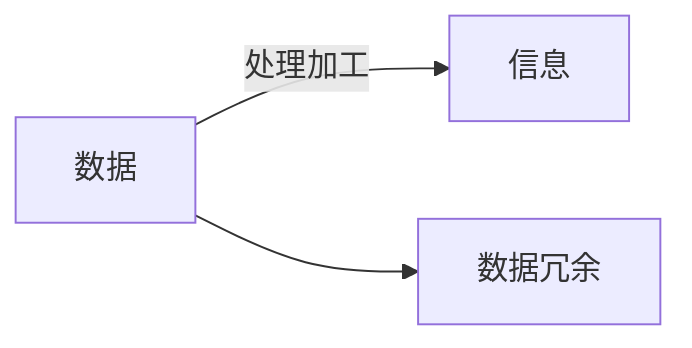
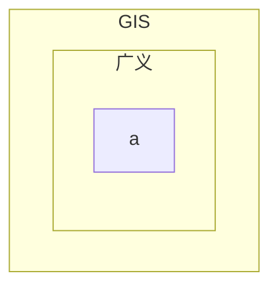

# NUIST地信原理

## 课程概况

| 理论课 | 实习课 |
| ------ | ------ |
| 48学时 | 16学时 |

## 1 概论

### 1.1 GIS的基本概念

#### 1.1.1 信息与地理信息

> **信息**是核心部分，因为分析对象和我们想得到的结果都是地理信息。

##### 数据和信息

* 数据data
  * 原始记录，未经加工的原始资料
  * 对客观对象的表示
* 信息information
  * 内容数量或特征

###### 数据和信息的联系与区别

##### 地理数据和地理信息

###### 地理数据的特征

#### 1.1.2 信息系统

##### 信息系统及其类型

#### 1.1.3 地理信息系统

##### 地理信息系统的定义

#### 1.1.4 地理信息系统的外延

##### GIS的术语

##### GIS中S的演变

我认为地理信息服务中的service是一种狭义概念，特指GIS成熟之后走向市场的应用服务，例如导航服务。
其实从广义的service概念来看，System也可以算是（主要面向研究人员的）服务。
而science由system发展而来，这个过程与当年从信息技术（IT）迈向信息科学类似。

### 1.2 GIS的组成

#### 1.2.1 硬件系统

#### 1.2.2 软件系统

#### 1.2.3 空间数据

#### 1.2.4 地学模型

#### 1.2.5 人员

### 1.3 GIS的功能

### 1.4 GIS与其他学科的关系

### 1.5 GIS应用范畴

### 1.6 GIS发展历程

## 2 地理空间数学基础

### **2.1** 地球空间参考

### **2.2** 空间数据投影

### **2.3** 空间坐标转换

### **2.4** 空间尺度

### **2.5** 地理格网

## **3** 空间数据模型

### **3.1** 地理空间与空间抽象

### **3.2** 空间数据概念模型

### **3.3** 空间数据逻辑模型

### **3.4** 空间数据与空间关系

## 4 空间数据结构

### **4.1** 矢量数据结构

### **4.2** 栅格数据结构

### **4.3** 矢栅与栅格数据的融合与转换

### **4.4** 镶嵌数据结构

### **4.5** 多维数据结构

## 5 空间数据组织与管理

### **5.1** 空间数据库概述

### **5.2** 空间数据库设计

### **5.3** 空间数据特征与组织

### **5.4** 空间数据管理

### **5.5** 空间数据检索

## 6 空间数据采集与处理

### **6.1** 概述

### **6.2** 数据采集

### **6.3** 数据编辑与拓扑关系

### **6.4** 数学基础变换

### **6.5** 数据重构

### **6.6** 图形拼接

### **6.8** 数据压缩

### **6.9** 数据质量评价与控制

### **6.10** 数据入库

## 7 **GIS**基本空间分析

### 7.1 空间分析概述

### 7.2 空间对象基本度量方法

### 7.3 叠置分析

### 7.4 缓冲区分析

### 7.5 窗口分析

### 7.6 网络分析

## 8 **DEM**与数字地形分析

### **8.1** 基本概念

### **8.2 DEM** 建立

### **8.3** 数字地形分析

## 9 **GIS**空间统计分析

### **9.1** 空间统计概述

### **9.2** 基本统计量

### **9.3** 探索性数据分析

### **9.4** 空间数据常规统计与分析

### **9.5** 空间插值

### **9.6** 空间统计与空间关系建模

## 10 地理信息可视化

### **10.1** 地理信息可视化概述

### **10.2** 地理信息输出方式与类型

### **10.3** 可视化的一般原则

### **10.4** 可视化表现形式

## 11 网络 **GIS** 与地理信息服务

### **11.1 GIS** 的平台网络化与应该服务化

### **11.2** 网络地理信息系统

### **11.3** 地理信息的网络服务

